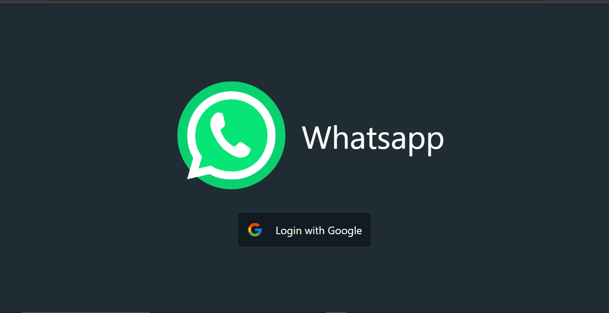
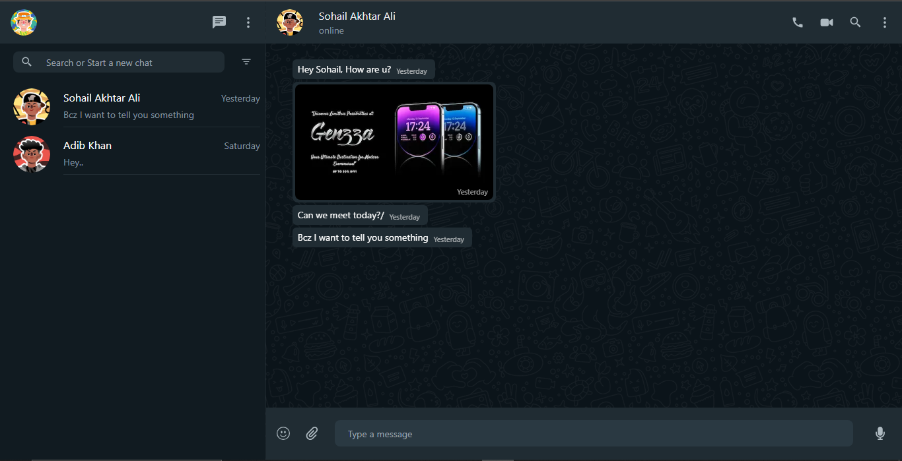

# WhatsApp Web

WhatsApp Web is a web-based chat application that allows users to send messages, make voice and video calls, and share images in real-time.

## Features

- Real-time chat functionality
- Voice and video call support
- Image sharing
- User authentication and profile management






## Tech Stack

- Next.js: A React framework for building server-side rendered (SSR) and static websites.
- Prisma: A modern database toolkit for TypeScript and Node.js that simplifies database access and management.
- Firebase: A comprehensive platform for building web and mobile applications that provides authentication and real-time database functionality.
- Zego Cloud: A cloud platform that offers audio and video communication services, including voice and video calling.
- Socket.IO: A library that enables real-time, bidirectional communication between web clients and servers.

## Getting Started

### Prerequisites

- Node.js (version X.X.X)
- npm (version X.X.X)

### Installation

1. Clone the repository:

```shell
git clone https://github.com/alisohail/whatsapp-web.git

    Install the dependencies:

shell

cd client
npm install

    Set up the environment variables:
        Create a .env file in the project root directory.
        Add the necessary environment variables (e.g., API keys, database connection strings) to the .env file.

    Start the application:

shell

npm run dev

    Open your browser and visit http://localhost:3000.


cd server
    npx prisma init
    npx prisma generate
    npx prisma db push


    npx prisma studio

    Open your browser and visit http://localhost:5555/
Usage

    Register a new account or log in with your existing account.
    Navigate to the chat section to start a conversation with other users.
    Use the search functionality to find specific messages or users.
    Initiate voice or video calls with other users.
    Upload and share images with your contacts.
    Update your profile picture and personal information.

Contributing

Contributions are welcome! If you have any ideas, suggestions, or bug reports, please open an issue or submit a pull request.

